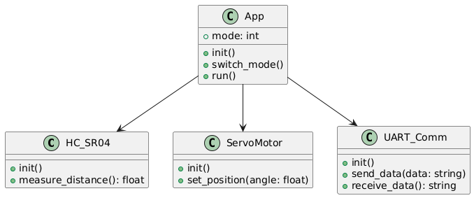

# Projet STM32F407 - Du capteur à l'actionneur

## Description du projet
Ce projet utilise un microcontrôleur STM32F407VGTx pour interfacer un capteur de distance HC-SR04 avec un servo-moteur. Le système peut fonctionner dans deux modes différents, contrôlables via un bouton-poussoir ou par commande série.

## Configuration des broches

### Broches principales utilisées dans le projet

| Broche | Fonction | Description |
|--------|----------|-------------|
| PD12   | ECHO     | Entrée du signal ECHO du capteur HC-SR04 |
| PD13   | BUTTON   | Bouton-poussoir pour changer de mode |
| PD14   | LED_BLUE | LED bleue (allumée en mode 1) |
| PD15   | LED_GREEN| LED verte (allumée en mode 2) |
| PA0    | TIM2_CH1 | Canal 1 du Timer 2 (PWM du servo-moteur) |
| PA1    | TIM2_CH2 | Canal 2 du Timer 2 (utilisé pour le signal TRIG du HC-SR04) |
| PA2    | USART2_TX| Transmission de données série |
| PA3    | USART2_RX| Réception de données série |

### Disponibilité des timers pour PWM

Le STM32F407 dispose de plusieurs timers qui peuvent être configurés pour générer des signaux PWM :
- TIM2 (canaux 1 et 2 sont accessibles via PA0 et PA1)
- D'autres timers avancés peuvent être utilisés selon les besoins du projet

## Modes de fonctionnement

### Mode 1
- LED bleue (PD14) allumée
- Position du servo-moteur proportionnelle à la distance mesurée (entre 5 et 25 cm)

### Mode 2
- LED verte (PD15) allumée
- Position du servo-moteur contrôlée par commande série

## Communication série
- Transmission de la distance mesurée toutes les secondes
- Réception des commandes pour changer de mode et contrôler le servo-moteur en mode 2
- Utilise USART2 (PA2 pour TX, PA3 pour RX)

## Modules à développer
1. Module de gestion du capteur HC-SR04 (singleton)
2. Module de gestion du servo-moteur (singleton)
3. Module de communication série (singleton)
4. Code principal de l'application

## Notes importantes
- La mesure de distance doit être effectuée toutes les 250 ms
- Le signal PWM pour le servo-moteur doit être configuré selon les spécifications du servo utilisé
- Un protocole de communication série doit être défini (suggestion : utiliser 1 octet)
  
## Diagramme de classe

